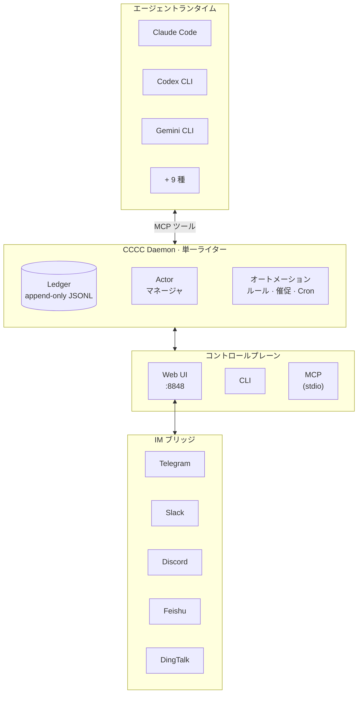

<div align="center">

# CCCC

### ローカルファースト・マルチエージェント協調カーネル

複数のコーディングエージェントを**永続的で協調されたシステム**として運用 — バラバラのターミナルセッションではなく。

`pip install cccc-pair && cccc` — ゼロインフラ、プロダクション級のパワー。

[](https://pypi.org/project/cccc-pair/)
[](https://pypi.org/project/cccc-pair/)
[](LICENSE)
[](https://dweb-channel.github.io/cccc/)

[English](README.md) | [中文](README.zh-CN.md) | **日本語**

</div>

---

## 課題

複数のコーディングエージェントを使う現実：

- **コンテキストの喪失** — 協調記録はターミナルのスクロールバッファに埋もれ、再起動で消える
- **到達保証なし** — エージェントがメッセージを*読んだ*かどうか確認できない
- **運用の断片化** — 起動/停止/復旧/エスカレーションがツールごとに分散
- **リモートアクセス不可** — 長時間稼働中のグループを外出先から確認できない

これらは些細な問題ではありません。マルチエージェント環境が「脆いデモ」から「信頼できるワークフロー」に進化できない根本原因です。

## CCCC の役割

CCCC は `pip install` 一つで導入完了、外部依存ゼロ — データベース不要、メッセージブローカー不要、Docker 必須ではありません。それでいて、プロダクション級メッセージングシステムと同等の運用信頼性を提供：

| 機能 | 実現方法 |
|---|---|
| **唯一の事実源** | append-only ledger（`ledger.jsonl`）が全メッセージ・イベントを記録 — 再生可能、監査可能、喪失なし |
| **信頼性のあるメッセージング** | 既読カーソル、attention ACK、reply-required 義務追跡 — 誰が何を読んだか明確 |
| **統一コントロールプレーン** | Web UI、CLI、MCP ツール、IM ブリッジがすべて 1 つの daemon に接続 — 状態の分断なし |
| **マルチランタイム編成** | Claude Code、Codex CLI、Gemini CLI、Copilot など 12 種のランタイムを同一グループ内で混在利用 |
| **ロールベース協調** | Foreman + Peer ロールモデル、権限境界と宛先ルーティング（`@all`、`@peers`、`@foreman`） |
| **リモート運用** | Telegram、Slack、Discord、Feishu、DingTalk にブリッジ — スマートフォンからグループを管理 |


## クイックスタート

### インストール

```bash
pip install -U cccc-pair
```

> **要件**: Python 3.9+、macOS / Linux / Windows

### 起動

```bash
cccc
```

**http://127.0.0.1:8848** を開く — Web UI が利用可能。

### マルチエージェントグループの作成

```bash
cd /path/to/your/repo
cccc attach .                              # ディレクトリを scope として紐付け
cccc setup --runtime claude                # ランタイムの MCP を設定
cccc actor add foreman --runtime claude    # 最初の actor が foreman に
cccc actor add reviewer --runtime codex    # peer を追加
cccc group start                           # 全 actor を起動
cccc send "タスクを分割して実装を開始してください。" --to @all
```

これで 2 つのエージェントが永続グループ内で協調し、完全なメッセージ履歴、到達追跡、Web ダッシュボードを備えた状態になります。

## アーキテクチャ



**設計上の重要な決定：**

- **Daemon は単一ライター** — すべての状態変更が 1 つのプロセスを経由し、競合状態を排除
- **Ledger は append-only** — イベントは不変、履歴は信頼性が高くデバッグ可能
- **ポートは薄い** — Web、CLI、MCP、IM ブリッジはステートレスなフロントエンド；daemon が全真実を保持
- **ランタイムホーム `CCCC_HOME`**（デフォルト `~/.cccc/`）— ランタイム状態はリポジトリの外に保持

## サポートランタイム

CCCC は 12 種のランタイムでエージェントを編成。同一グループ内で各 actor が異なるランタイムを使用可能。

| ランタイム | MCP 自動設定 | コマンド |
|-----------|:----------:|---------|
| Claude Code | ✅ | `claude` |
| Codex CLI | ✅ | `codex` |
| Gemini CLI | ✅ | `gemini` |
| Droid | ✅ | `droid` |
| Amp | ✅ | `amp` |
| Auggie | ✅ | `auggie` |
| Neovate | ✅ | `neovate` |
| Copilot | — | `copilot` |
| Cursor | — | `cursor-agent` |
| Kilo Code | — | `kilocode` |
| OpenCode | — | `opencode` |
| Custom | — | 任意のコマンド |

```bash
cccc setup --runtime claude    # ランタイムの MCP を自動設定
cccc runtime list --all        # 利用可能なランタイムを表示
cccc doctor                    # 環境とランタイムの可用性を検証
```

## メッセージングと協調

CCCC は IM グレードのメッセージングセマンティクスを実装 — 「ターミナルにテキストを貼り付ける」だけではありません：

- **宛先ルーティング** — `@all`、`@peers`、`@foreman`、または特定の actor ID
- **既読カーソル** — 各エージェントが MCP 経由で明示的に既読をマーク
- **返信と引用** — 構造化された `reply_to` + 引用コンテキスト
- **Attention ACK** — 優先メッセージは明示的な確認が必要
- **Reply-required 義務** — 受信者が返信するまで追跡
- **自動ウェイク** — メッセージ受信時、無効化された agent を自動起動

PTY actor にはターミナル注入、headless actor にはシステム通知で配信。daemon が全メッセージの到達状態を追跡。

## オートメーションとポリシー

内蔵ルールエンジンが運用面の懸念を処理し、手動監視を不要に：

| ポリシー | 機能 |
|----------|------|
| **催促（Nudge）** | 設定可能なタイムアウト後に未読メッセージを agent にリマインド |
| **Reply-required フォローアップ** | 必須返信が遅延した場合にエスカレート |
| **Actor アイドル検出** | agent が沈黙した際に foreman に通知 |
| **Keepalive** | foreman への定期的なチェックインリマインダー |
| **沈黙検出** | グループ全体が静かになった場合にアラート |

内蔵ポリシーに加え、カスタムオートメーションルールを作成可能：

- **インターバルトリガー** — 「N 分ごとにスタンドアップリマインダーを送信」
- **Cron スケジュール** — 「平日毎朝 9 時にステータスチェックを投稿」
- **ワンタイムトリガー** — 「今日 17 時にグループを一時停止」
- **運用アクション** — グループ状態の設定や actor ライフサイクルの制御（管理者のみ、ワンタイムのみ）

## Web UI

内蔵 Web UI `http://127.0.0.1:8848` の機能：

- **チャットビュー** — `@mention` オートコンプリートとリプライスレッド
- **actor ごとの埋め込みターミナル**（xterm.js）— 各 agent の作業状況をリアルタイムで確認
- **グループ & actor 管理** — 作成、設定、起動、停止、再起動
- **オートメーションルールエディター** — トリガー、スケジュール、アクションを視覚的に設定
- **Context パネル** — 共有ビジョン、スケッチ、マイルストーン、タスク
- **IM ブリッジ設定** — Telegram/Slack/Discord/Feishu/DingTalk に接続
- **設定** — メッセージングポリシー、配信チューニング、ターミナルトランスクリプト制御
- **ライト / ダーク / システムテーマ**

| チャット | ターミナル |
|:--------:|:----------:|
|  |  |

### リモートアクセス

localhost 外から Web UI にアクセスする場合：

- **Cloudflare Tunnel**（推奨）— `cloudflared tunnel --url http://127.0.0.1:8848`
- **Tailscale** — tailnet IP にバインド：`CCCC_WEB_HOST=$TAILSCALE_IP cccc`
- ローカル以外のアクセスでは必ず `CCCC_WEB_TOKEN` を設定

## IM ブリッジ

Working Group を IM プラットフォームにブリッジ：

```bash
cccc im set telegram --token-env TELEGRAM_BOT_TOKEN
cccc im start
```

| プラットフォーム | ステータス |
|-----------------|-----------|
| Telegram | ✅ 対応済み |
| Slack | ✅ 対応済み |
| Discord | ✅ 対応済み |
| Feishu / Lark | ✅ 対応済み |
| DingTalk | ✅ 対応済み |

任意の対応プラットフォームから `/send @all <メッセージ>` でエージェントに指示、`/status` でグループ状態を確認、`/pause` / `/resume` で運用を制御 — すべてスマートフォンから。

## CLI リファレンス

```bash
# ライフサイクル
cccc                           # daemon + Web UI を起動
cccc daemon start|status|stop  # daemon 管理

# グループ
cccc attach .                  # カレントディレクトリを紐付け
cccc groups                    # 全グループを一覧
cccc use <group_id>            # アクティブグループを切り替え
cccc group start|stop          # 全 actor を起動/停止

# Actor
cccc actor add <id> --runtime <runtime>
cccc actor start|stop|restart <id>

# メッセージング
cccc send "メッセージ" --to @all
cccc reply <event_id> "返信"
cccc tail -n 50 -f             # ledger をリアルタイム追跡

# 受信箱
cccc inbox                     # 未読メッセージを表示
cccc inbox --mark-read         # 全件既読にする

# 運用
cccc doctor                    # 環境チェック
cccc setup --runtime <name>    # MCP を設定
cccc runtime list --all        # 利用可能なランタイム

# IM
cccc im set <platform> --token-env <ENV_VAR>
cccc im start|stop|status
```

## MCP ツール

エージェントは **49 の MCP ツール**（7 つの名前空間）を通じて CCCC と対話：

| 名前空間 | 数 | 例 |
|----------|:--:|------|
| **セッション** | 2 | `cccc_bootstrap`（ワンコール初期化）、`cccc_help`（運用プレイブック） |
| **メッセージング** | 7 | `cccc_message_send`、`cccc_message_reply`、`cccc_file_send`、`cccc_inbox_list`、`cccc_inbox_mark_read` … |
| **グループ & Actor** | 10 | `cccc_group_info`、`cccc_group_list`、`cccc_actor_add/remove/start/stop/restart`、`cccc_runtime_list`、`cccc_group_set_state` |
| **オートメーション** | 2 | `cccc_automation_state`、`cccc_automation_manage`（ルールの作成/更新/有効化/無効化/削除） |
| **Context** | 19 | `cccc_context_get/sync`、`cccc_vision_update`、`cccc_sketch_update`、`cccc_milestone_*`、`cccc_task_*`、`cccc_note_*`、`cccc_reference_*`、`cccc_presence_*` |
| **Headless** | 3 | `cccc_headless_status`、`cccc_headless_set_status`、`cccc_headless_ack_message` |
| **システム** | 6 | `cccc_notify_send/ack`、`cccc_terminal_tail`、`cccc_project_info`、`cccc_debug_snapshot`、`cccc_debug_tail_logs` |

MCP アクセスを持つエージェントは自己組織化が可能：受信箱の確認、返信、タスクとマイルストーンの管理、オートメーションルールの設定、ピアとの協調 — すべて権限範囲内で。

## CCCC の位置づけ

| シナリオ | 適合度 |
|----------|--------|
| 複数のコーディングエージェントが 1 つのコードベースで協調 | ✅ コアユースケース |
| 人間 + エージェントの協調、完全な監査証跡付き | ✅ コアユースケース |
| 長時間稼働グループをスマートフォン/IM でリモート管理 | ✅ 強い適合 |
| マルチランタイムチーム（例：Claude + Codex + Gemini） | ✅ 強い適合 |
| 単一エージェントのローカルコーディングヘルパー | ⚠️ 動作するが、CCCC の価値は複数参加者で発揮 |
| 純粋な DAG ワークフローオーケストレーション | ❌ 専用オーケストレーターを使用；CCCC は補完的に利用可能 |

CCCC は**協調カーネル** — 協調レイヤーを担い、外部の CI/CD、オーケストレーター、デプロイツールとの組み合わせを維持します。

## セキュリティ

- **Web UI は高権限。** ローカル以外のアクセスでは必ず `CCCC_WEB_TOKEN` を設定。
- **Daemon IPC は認証なし。** デフォルトで localhost にのみバインド。
- **IM ボットトークン** は環境変数から読み取り、設定ファイルには保存しない。
- **ランタイム状態** は `CCCC_HOME`（`~/.cccc/`）に保持、リポジトリ内には置かない。

詳細なセキュリティガイダンスは [SECURITY.md](SECURITY.md) を参照。

## ドキュメント

📚 **[完全なドキュメント](https://dweb-channel.github.io/cccc/)**

| セクション | 説明 |
|-----------|------|
| [クイックスタート](https://dweb-channel.github.io/cccc/guide/getting-started/) | インストール、起動、最初のグループ作成 |
| [ユースケース](https://dweb-channel.github.io/cccc/guide/use-cases) | 実践的なマルチエージェントシナリオ |
| [Web UI ガイド](https://dweb-channel.github.io/cccc/guide/web-ui) | ダッシュボードのナビゲーション |
| [IM ブリッジ設定](https://dweb-channel.github.io/cccc/guide/im-bridge/) | Telegram、Slack、Discord、Feishu、DingTalk の接続 |
| [運用ランブック](https://dweb-channel.github.io/cccc/guide/operations) | 復旧、トラブルシューティング、メンテナンス |
| [CLI リファレンス](https://dweb-channel.github.io/cccc/reference/cli) | 完全なコマンドリファレンス |
| [アーキテクチャ](https://dweb-channel.github.io/cccc/reference/architecture) | 設計決定とシステムモデル |
| [機能詳細](https://dweb-channel.github.io/cccc/reference/features) | メッセージング、オートメーション、ランタイムの詳細 |
| [CCCS 標準](docs/standards/CCCS_V1.md) | 協調プロトコル仕様 |
| [Daemon IPC 標準](docs/standards/CCCC_DAEMON_IPC_V1.md) | IPC プロトコル仕様 |

## インストールオプション

### pip（推奨）

```bash
pip install -U cccc-pair
```

### ソースから

```bash
git clone https://github.com/ChesterRa/cccc
cd cccc
pip install -e .
```

### uv（高速、Windows 推奨）

```bash
uv venv -p 3.11 .venv
uv pip install -e .
uv run cccc --help
```

### Docker

```bash
cd docker
CCCC_WEB_TOKEN=your-secret docker compose up -d
```

Docker イメージには Claude Code、Codex CLI、Gemini CLI、Factory CLI がバンドル済み。完全な設定は [`docker/`](docker/) を参照。

### 0.3.x からのアップグレード

0.4.x はゼロからの書き直しです。先にクリーンアンインストール：

```bash
pipx uninstall cccc-pair || true
pip uninstall cccc-pair || true
rm -f ~/.local/bin/cccc ~/.local/bin/ccccd
```

再インストール後、`cccc doctor` で環境を確認。

> tmux-first の 0.3.x は [cccc-tmux](https://github.com/ChesterRa/cccc-tmux) にアーカイブ済み。

## コントリビューション

コントリビューションを歓迎します：

1. 新しい Issue を開く前に既存の [Issues](https://github.com/ChesterRa/cccc/issues) を確認
2. バグ報告：`cccc version`、OS、正確なコマンド、再現手順を含める
3. 機能リクエスト：問題、提案する動作、運用への影響を記述
4. ランタイム状態は `CCCC_HOME` に保持 — リポジトリにコミットしない

## License

[Apache-2.0](LICENSE)
