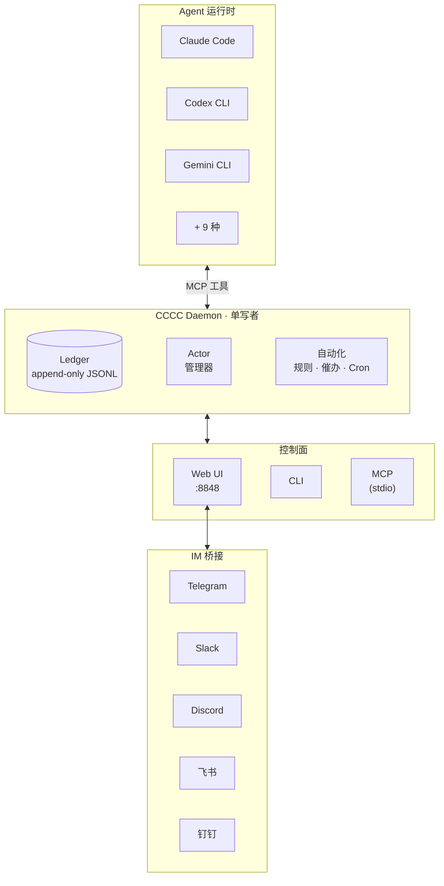

<div align="center">


# CCCC

### 本地优先多智能体协作内核

**一个轻量级、却具备基础设施级可靠性的多智能体框架。**

原生聊天式协作，提示词驱动，平台与 agent 双向调度。

让多个 coding agent 作为一套**持久化、可协调的系统**运行 — 而不是一堆各自为政的终端窗口。

三条命令即可开始。零基础设施，生产级能力。

[](https://pypi.org/project/cccc-pair/)
[](https://pypi.org/project/cccc-pair/)
[](LICENSE)
[](https://chesterra.github.io/cccc/)

[English](README.md) | **中文** | [日本語](README.ja.md)

</div>

---

## 使用官方 SDK 进行二次开发

如果你要把 CCCC 接入应用、服务、插件或 IDE，请使用官方 SDK 仓库：

- [cccc-sdk](https://github.com/ChesterRa/cccc-sdk)
- Python 包：`cccc-sdk`（import 名称 `cccc_sdk`）
- TypeScript 包：`cccc-sdk`

SDK 客户端会连接同一个 CCCC daemon，并共享同一个 `CCCC_HOME` 运行时状态。

## 为什么说 v0.4.0 是代际升级

- **聊天式编排**：在 Web 聊天里像和同事对话一样布置任务，并实时看到送达/已读/确认/回复状态。
- **工作流可配置**：通过 guidance 提示词与 automation 规则定义多智能体协作方式，不再依赖脆弱脚本拼装。
- **双向调度能力**：CCCC 可以调度 agent，agent 也能通过 MCP 工具反向配置和调度 CCCC 工作流。
- **不止于浏览器**：同一套协作模型可无缝扩展到 Telegram/Slack/Discord/飞书/钉钉。

## 痛点

多智能体开发的现实困境：

- **上下文丢失** — 协作记录散落在终端滚动缓冲区，重启即消失
- **触达无保障** — agent 到底有没有*读到*你的消息？无从得知
- **运维碎片化** — 启停、恢复、催办、提醒分散在多个工具里
- **无法远程值守** — 长时间运行的协作组，出门就失控

这些不是小问题。它们是绝大多数多智能体方案停留在"脆弱 demo"阶段的根本原因。

## CCCC 能做什么

CCCC 只需一条 `pip install`，零外部依赖 — 不需要数据库、不需要消息队列、不强制 Docker。但它提供的运维可靠性，媲美生产级消息系统：

| 能力 | 实现方式 |
|---|---|
| **唯一事实源** | append-only ledger（`ledger.jsonl`）记录所有消息和事件 — 可回放、可审计、永不丢失 |
| **可靠的消息语义** | 已读游标、attention ACK、reply-required 义务追踪 — 谁读了什么一清二楚 |
| **统一控制面** | Web UI、CLI、MCP 工具、IM 桥接全部对接同一 daemon — 不存在状态分裂 |
| **多运行时编排** | Claude Code、Codex CLI、Gemini CLI、Copilot 等 12 种运行时可在同一协作组内混用 |
| **角色化协调** | Foreman + Peer 角色模型，权限边界清晰，收件人路由精确（`@all`、`@peers`、`@foreman`） |
| **远程运维** | 桥接至 Telegram、Slack、Discord、飞书、钉钉 — 手机上即可管理协作组 |

## CCCC 长什么样

<div align="center">

<video src="https://github.com/user-attachments/assets/8f9c3986-f1ba-4e59-a114-bcb383ff49a7" controls="controls" muted="muted" autoplay="autoplay" loop="loop" style="max-width: 100%;">
</video>

</div>

## 快速上手

### 安装

```bash
# 稳定通道（PyPI）
pip install -U cccc-pair

# RC 通道（TestPyPI）
pip install -U --pre \
  --index-url https://test.pypi.org/simple/ \
  --extra-index-url https://pypi.org/simple/ \
  cccc-pair
```

> **环境要求**: Python 3.9+，macOS / Linux / Windows

### 启动

```bash
cccc
```

打开 **http://127.0.0.1:8848** — Web UI 就绪。

### 建立多智能体协作组

```bash
cd /path/to/your/repo
cccc attach .                              # 绑定当前目录为 scope
cccc setup --runtime claude                # 配置运行时的 MCP
cccc actor add foreman --runtime claude    # 第一个 actor 自动成为 foreman
cccc actor add reviewer --runtime codex    # 添加 peer
cccc group start                           # 启动所有 actor
cccc send "请拆分任务并开始实现。" --to @all
```

此刻你已拥有两个 agent 在一个持久化协作组中协同工作，具备完整的消息历史、触达追踪和 Web 看板。

## 程序化接入（SDK）

如果你要从外部应用或服务编程接入 CCCC，请使用官方 SDK：

```bash
pip install -U cccc-sdk
npm install cccc-sdk
```

SDK 不包含 daemon，需要连接已运行的 `cccc` 本体实例。

## 架构



**关键设计决策：**

- **Daemon 单写者** — 所有状态变更经由同一进程，杜绝竞态条件
- **Ledger append-only** — 事件不可篡改，历史可靠且可调试
- **入口薄层化** — Web、CLI、MCP、IM 桥接均为无状态前端；daemon 拥有全部真相
- **运行时目录 `CCCC_HOME`**（默认 `~/.cccc/`）— 运行时状态与代码仓库严格分离

## 支持的运行时

CCCC 跨 12 种运行时编排 agent。同一协作组内，每个 actor 可使用不同的运行时。

| 运行时 | 自动 MCP 配置 | 命令 |
|---------|:----------:|------|
| Claude Code | ✅ | `claude` |
| Codex CLI | ✅ | `codex` |
| Gemini CLI | ✅ | `gemini` |
| Droid | ✅ | `droid` |
| Amp | ✅ | `amp` |
| Auggie | ✅ | `auggie` |
| Neovate | ✅ | `neovate` |
| Copilot | — | `copilot` |
| Cursor | — | `cursor-agent` |
| Kilo Code | — | `kilocode` |
| OpenCode | — | `opencode` |
| Custom | — | 任意命令 |

```bash
cccc setup --runtime claude    # 自动配置该运行时的 MCP
cccc runtime list --all        # 列出所有可用运行时
cccc doctor                    # 检查环境和运行时可用性
```

## 消息与协调

CCCC 实现的是 IM 级消息语义，而不是"往终端里粘贴一段文字"：

- **收件人路由** — `@all`、`@peers`、`@foreman`，或指定 actor ID
- **已读游标** — 每个 agent 通过 MCP 显式标记已读
- **回复与引用** — 结构化的 `reply_to` + 引用上下文
- **Attention ACK** — 高优先级消息要求显式确认
- **Reply-required 义务** — 持续追踪直到收件人回复
- **自动唤醒** — 收到消息时，已停用的 actor 自动启动

PTY 模式的 actor 通过终端注入接收消息，headless 模式通过系统通知接收。daemon 对每条消息的触达状态持续追踪。

## 自动化与策略

内置规则引擎处理运维关切，免去人工盯盘：

| 策略 | 功能 |
|------|------|
| **催办（Nudge）** | 可配置超时后提醒 agent 处理未读消息 |
| **Reply-required 跟进** | 必回消息逾期时升级提醒 |
| **Actor 空闲检测** | agent 沉默时通知 foreman |
| **Keepalive** | 周期性向 foreman 发送签到提醒 |
| **静默检测** | 整个协作组无活动时告警 |

除内置策略外，还可创建自定义自动化规则：

- **间隔触发** — "每 N 分钟发送一次站会提醒"
- **Cron 排程** — "工作日每天 9 点发布状态检查"
- **一次性触发** — "今天下午 5 点暂停协作组"
- **运维动作** — 设置组状态或控制 actor 生命周期（仅管理员，仅一次性）

## Web UI

内置 Web UI `http://127.0.0.1:8848` 提供：

- **聊天界面** — `@mention` 自动补全、回复串联
- **逐 actor 嵌入式终端**（xterm.js）— 实时查看每个 agent 的工作状态
- **协作组与 actor 管理** — 创建、配置、启停、重启
- **自动化规则编辑器** — 可视化配置触发器、排程和动作
- **Context 面板** — 共享 vision、sketch、里程碑和任务
- **IM 桥接配置** — 连接 Telegram/Slack/Discord/飞书/钉钉
- **设置** — 消息策略、触达调优、终端日志控制
- **亮色 / 暗色 / 跟随系统 主题**

| 聊天 | 终端 |
|:----:|:----:|
|  |  |

### 远程访问

从外部访问 Web UI：

- **Cloudflare Tunnel**（推荐）— `cloudflared tunnel --url http://127.0.0.1:8848`
- **Tailscale** — 绑定 tailnet IP：`CCCC_WEB_HOST=$TAILSCALE_IP cccc`
- 非本地访问时，务必设置 `CCCC_WEB_TOKEN`

## IM 桥接

将协作组桥接到团队 IM 平台：

```bash
cccc im set telegram --token-env TELEGRAM_BOT_TOKEN
cccc im start
```

| 平台 | 状态 |
|------|------|
| Telegram | ✅ 已支持 |
| Slack | ✅ 已支持 |
| Discord | ✅ 已支持 |
| 飞书 / Lark | ✅ 已支持 |
| 钉钉 | ✅ 已支持 |

在任一已支持平台上，使用 `/send @all <消息>` 与 agent 对话、`/status` 查看组状态、`/pause` / `/resume` 控制运维 — 全部在手机上完成。

## CLI 速查

```bash
# 生命周期
cccc                           # 启动 daemon + Web UI
cccc daemon start|status|stop  # daemon 管理

# 协作组
cccc attach .                  # 绑定当前目录
cccc groups                    # 列出所有组
cccc use <group_id>            # 切换活跃组
cccc group start|stop          # 启停所有 actor

# Actor
cccc actor add <id> --runtime <runtime>
cccc actor start|stop|restart <id>

# 消息
cccc send "消息" --to @all
cccc reply <event_id> "回复"
cccc tail -n 50 -f             # 实时追踪 ledger

# 收件箱
cccc inbox                     # 查看未读消息
cccc inbox --mark-read         # 全部标为已读

# 运维
cccc doctor                    # 环境检查
cccc setup --runtime <name>    # 配置 MCP
cccc runtime list --all        # 可用运行时

# IM
cccc im set <platform> --token-env <ENV_VAR>
cccc im start|stop|status
```

## MCP 工具

Agent 通过 **49 个 MCP 工具**（7 个命名空间）与 CCCC 交互：

| 命名空间 | 数量 | 示例 |
|----------|:----:|------|
| **会话** | 2 | `cccc_bootstrap`（一次性初始化）、`cccc_help`（操作手册） |
| **消息** | 7 | `cccc_message_send`、`cccc_message_reply`、`cccc_file_send`、`cccc_inbox_list`、`cccc_inbox_mark_read` … |
| **协作组 & Actor** | 10 | `cccc_group_info`、`cccc_group_list`、`cccc_actor_add/remove/start/stop/restart`、`cccc_runtime_list`、`cccc_group_set_state` |
| **自动化** | 2 | `cccc_automation_state`、`cccc_automation_manage`（创建/更新/启用/停用/删除规则） |
| **Context** | 19 | `cccc_context_get/sync`、`cccc_vision_update`、`cccc_sketch_update`、`cccc_milestone_*`、`cccc_task_*`、`cccc_note_*`、`cccc_reference_*`、`cccc_presence_*` |
| **Headless** | 3 | `cccc_headless_status`、`cccc_headless_set_status`、`cccc_headless_ack_message` |
| **系统** | 6 | `cccc_notify_send/ack`、`cccc_terminal_tail`、`cccc_project_info`、`cccc_debug_snapshot`、`cccc_debug_tail_logs` |

拥有 MCP 权限的 agent 可以自组织：读取收件箱、回复、管理任务与里程碑、设置自动化规则、与同伴协调 — 均在权限边界内。

## CCCC 的定位

| 场景 | 适配度 |
|------|--------|
| 多个 coding agent 在同一代码库中协作 | ✅ 核心场景 |
| 人类 + 智能体协调，具备完整审计轨迹 | ✅ 核心场景 |
| 长时间运行的协作组，通过手机/IM 远程管理 | ✅ 强适配 |
| 混合运行时团队（如 Claude + Codex + Gemini） | ✅ 强适配 |
| 单 agent 本地编码辅助 | ⚠️ 可用，但 CCCC 的价值在多参与者时才充分体现 |
| 纯 DAG 工作流编排 | ❌ 建议使用专用编排器，CCCC 可作为协作层补充 |

CCCC 是**协作内核** — 它拥有协调层，与外部 CI/CD、编排器、部署工具保持可组合性。

## 安全

- **Web UI 属高权限入口。** 非本地访问时，务必设置 `CCCC_WEB_TOKEN`。
- **Daemon IPC 无认证。** 默认仅绑定 localhost。
- **IM bot token** 从环境变量读取，不存储在配置文件中。
- **运行时状态** 存放在 `CCCC_HOME`（`~/.cccc/`），不在代码仓库内。

详细安全指南见 [SECURITY.md](SECURITY.md)。

## 文档

📚 **[完整文档](https://chesterra.github.io/cccc/)**

| 章节 | 说明 |
|------|------|
| [快速上手](https://chesterra.github.io/cccc/guide/getting-started/) | 安装、启动、创建第一个协作组 |
| [场景示例](https://chesterra.github.io/cccc/guide/use-cases) | 实际多智能体场景 |
| [Web UI 指南](https://chesterra.github.io/cccc/guide/web-ui) | 看板导航 |
| [IM 桥接配置](https://chesterra.github.io/cccc/guide/im-bridge/) | 连接 Telegram、Slack、Discord、飞书、钉钉 |
| [运维手册](https://chesterra.github.io/cccc/guide/operations) | 恢复、排障、维护 |
| [CLI 参考](https://chesterra.github.io/cccc/reference/cli) | 完整命令参考 |
| [SDK（Python/TypeScript）](https://github.com/ChesterRa/cccc-sdk) | 用官方客户端将 CCCC 接入应用与服务 |
| [架构](https://chesterra.github.io/cccc/reference/architecture) | 设计决策与系统模型 |
| [功能详解](https://chesterra.github.io/cccc/reference/features) | 消息、自动化、运行时深度解读 |
| [CCCS 标准](docs/standards/CCCS_V1.md) | 协作协议规范 |
| [Daemon IPC 标准](docs/standards/CCCC_DAEMON_IPC_V1.md) | IPC 协议规范 |

## 安装选项

### pip（稳定版，推荐）

```bash
pip install -U cccc-pair
```

### pip（RC 版，TestPyPI）

```bash
pip install -U --pre \
  --index-url https://test.pypi.org/simple/ \
  --extra-index-url https://pypi.org/simple/ \
  cccc-pair
```

### 从源码安装

```bash
git clone https://github.com/ChesterRa/cccc
cd cccc
pip install -e .
```

### uv（快速，Windows 推荐）

```bash
uv venv -p 3.11 .venv
uv pip install -e .
uv run cccc --help
```

### Docker

```bash
cd docker
CCCC_WEB_TOKEN=your-secret docker compose up -d
```

Docker 镜像内置 Claude Code、Codex CLI、Gemini CLI 和 Factory CLI。完整配置见 [`docker/`](docker/)。

### 从 0.3.x 升级

0.4.x 是从零重写的新架构线。请先彻底卸载：

```bash
pipx uninstall cccc-pair || true
pip uninstall cccc-pair || true
rm -f ~/.local/bin/cccc ~/.local/bin/ccccd
```

然后重新安装并执行 `cccc doctor` 检查环境。

> tmux-first 的 0.3.x 版本已归档至 [cccc-tmux](https://github.com/ChesterRa/cccc-tmux)。

## 社区与支持

Telegram 社区: [t.me/ccccpair](https://t.me/ccccpair)  
微信: `dodd85`（添加时请备注“CCCC”，人多后会建群）

欢迎在社区中分享工作流、反馈问题，并与其他 CCCC 用户交流实践。

## 贡献

欢迎贡献。请注意：

1. 提交前先检查已有 [Issues](https://github.com/ChesterRa/cccc/issues)
2. Bug 报告：附上 `cccc version`、操作系统、完整命令和复现步骤
3. 功能建议：描述问题、期望行为和运维影响
4. 运行时状态放在 `CCCC_HOME` — 不要提交到仓库

## License

[Apache-2.0](LICENSE)
